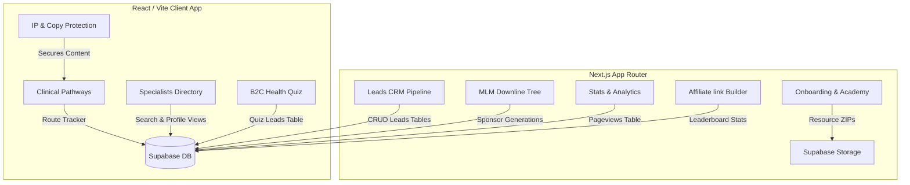

# TestBased Nutrition - Complete Ecosystem Codebase

This repository contains the complete codebase for the **TestBased Nutrition (TBN)** ecosystem. This unified platform bridges the public-facing **Customer B2C Website** and the back-office **Partner Hub B2B Portal**. 

By linking clinical pathways and a public practitioner directory with admin onboarding, CRM pipelines, affiliate attribution, and self-hosted traffic analytics, the TBN ecosystem automates the client journey, practitioner training, and revenue distribution.

---

## 🧭 Ecosystem Overview & Architecture

The TBN ecosystem is built as a dual-application architecture sharing a single **Supabase database** backend:



### 1. The Public B2C Client App (`/test-based-nutrition-ui`)
A modern, performant React application built with Vite and Tailwind CSS. It is the primary customer touchpoint, serving:
*   **7 Health Pathway Landing Pages:** Dynamic clinical hubs for Women's Health, Men's Health, Sports Performance, Pain & Fatigue, Skin Health, Neurodivergence, and Children's Health.
*   **Specialists & Clinics Directory:** A responsive 4-column cards grid allowing consumers to filter and search verified clinical partners by categories and geographic locations.
*   **High-Converting Profiles:** Compact specialist landing pages detailing credentials, testimonials (summarized to 50 words to avoid clutter), exact practice areas, and direct booking links.
*   **Health Assessment Quiz:** A step-by-step interactive intake flow helping users discover their optimal clinical pathways and scheduling initial testing appointments.
*   **Self-Hosted Pageview Tracker:** A lightweight background script (`TrafficTracker.tsx`) tracking paths, geolocating visitors via `ipapi.co`, identifying device types, and logging real-time views securely to the database.
*   **Global Content Safeguards:** Active copy, cut, drag, print, page-save, and DevTools inspection blockades to protect TBN's proprietary clinical literature and directories.

### 2. The B2B Partner Portal (`/partner-hub`)
A secure Next.js App Router portal designed for clinical partners and system administrators:
*   **Onboarding Checklists & Training (Learn):** Dynamic checklists, video courses, and mandatory quizzes (requiring an 80% pass score) checking practitioner competence.
*   **Clinical Protocols (Launch):** A gated repository of clinical documentation covering 50+ sub-pathways with one-click bulk ZIP downloading for offline clinical use.
*   **Business Accelerator (Grow):** Interactive interfaces for managing kits, building recurring subscriptions, and executing campaign templates.
*   **CRM Leads Pipeline:** A comprehensive management workspace for partner leads, quiz submissions, and booking enquiries. Features search, column filtering, direct CSV export, and a draggable Kanban board to track conversions.
*   **MLM Downline Visualizer (Lead):** A hierarchical organizational tree showing sponsor generation tiers, ranks, active partner counts, and enrollment history.
*   **Stats & Analytics Control Room:** A dashboard graphing 7-day traffic trends, channel shares, device ratios, and live incoming logs, alongside Google Analytics 4 (GA4) keys configurations.
*   **CMS Content Engine:** An administrative interface allowing directors to draft, categorize, and publish updates and news directly to B2C readers.

---

## 📈 Key Benefits & Business Logic

The TBN platform is engineered to align clinical excellence with automated operational growth:

### 1. For Clients & Patients (B2C Benefits)
*   **Precision Health Outcomes:** Replaces nutritional guesswork with clinical measurements (point-of-care biomarker testing and advanced lab profiles).
*   **Structured Pathway Guidance:** Simple 6-stage protocol bars (Discover, Test, Target, Transform, Retest, Escalate) provide clients with clear expectations of their care timeline.
*   **Localized Access to Experts:** The Specialists Directory instantly matches clients with verified practitioners nearby, utilizing automatic city-extraction parsing to avoid address clutter.
*   **Frictionless Intake & Diagnostics:** Integrated point-of-care testing combines with at-home testing options to minimize clinic wait times.

### 2. For Practitioners & Partners (B2B Benefits)
*   **Step-by-Step Clinic Blueprint:** Onboarding models ("Learn, Launch, Grow, Lead") guide partners from initial setup to running a regional multi-practitioner network.
*   **Turnkey Marketing & Sales System:** Access to the Marketing Hub equipped with local campaign templates, discovery call scripts, social media assets, and ChatGPT prompts.
*   **Compounding Subscription Income:** Partners earn recurring monthly income by enrolling clients in Zinzino subscriptions (BalanceOil+, ZinoBiotic+, Xtend+), building stable cash flow outside of consulting hours.
*   **Network Recruitment & Mentoring:** Interactive downline visualizers show team structures, allowing senior partners to support and earn commissions from junior clinics they onboard.
*   **Validated Professional Authority:** Completing TBN Academy modules and tests awards digital certificates, verifying the practitioner's competence in nutritional biochemistry.

### 3. For Platform Administrators (Ecosystem Benefits)
*   **Zero-Config Traffic Attribution:** The built-in tracker records visitor locations, devices, and campaigns before Google Analytics is set up, bypassing browser ad-blockers.
*   **Intellectual Property Protection:** Frosted-glass warning alerts and key-interceptors block scrapers, crawlers, and competitors from copying proprietary testing frameworks.
*   **Automated Partner Approval Pipeline:** Admins review partner registration submissions, manage directory visibility, and publish news via unified dashboard actions.
*   **CRM & Pipeline Automation:** Leads from public quizzes, contact forms, and partner applications funnel instantly to the portal, eliminating manual data entry.

---

## 🧪 Testing & Screening Framework

The TBN clinical methodology operates on a structured, three-tier testing hierarchy:

| Testing Tier | Location | Key Bio-Markers Measured | Clinical Action |
| :--- | :--- | :--- | :--- |
| **Foundational Testing** | In-Clinic or Online | Omega Balance Test, Gut Microbiome Test, FSH | Establish baseline cellular inflammation, fatty acid profile, hormone signalling, and microbiome diversity. |
| **Baseline Screening** | Finger-Prick Point-of-Care | Vitamin D, HbA1c, Ferritin, CRP / hs-CRP, Cortisol, Cystatin C, Folate, HCG-β, AMH, Progesterone, NT-proBNP, RSV / Influenza A&B, Rheumatoid Factor | Rapid, 15-minute diagnostic checks performed during the initial physical consultation. |
| **Advanced Screening** | Phlebotomy (Lab Referral) | Testosterone, Vitamin B12, FSH, Thyroid (TSH) | In-depth biochemical analysis triggered when symptoms or baseline scores suggest systemic imbalance. |

---

## 🛠 Tech Stack

*   **Front-End Frameworks:** React 18 / Vite (Main Site), Next.js 14 App Router (Partner Portal)
*   **Database & Backend:** Supabase (PostgreSQL database, Supabase Auth, Secure Storage Buckets)
*   **Styling & Design System:** Tailwind CSS & Vanilla CSS utilizing a refined warm sand, cream, and deep-red (`#8B1A1A`) palette with custom Google Fonts (Inter, Outfit, Georgia Serif)
*   **Component Architecture:** Radix UI primitives & shadcn/ui components
*   **Data Visualization:** SVG Charts, responsive grid views, and HTML5 canvas integrations
*   **Build & Package Management:** `npm` (Main Site), `pnpm` (Partner Portal)

---

## 🚀 Getting Started

### Prerequisites
*   Node.js 18.0.0 or higher
*   A running Supabase instance (schema tables defined in `setup_database.sql` and migrations)

### 1. Clone and Configure
Clone the codebase and create your environment configuration files:

Create `/test-based-nutrition-ui/.env.local`:
```env
VITE_SUPABASE_URL=your_supabase_project_url
VITE_SUPABASE_ANON_KEY=your_supabase_anon_key
```

Create `/partner-hub/.env.local`:
```env
NEXT_PUBLIC_SUPABASE_URL=your_supabase_project_url
NEXT_PUBLIC_SUPABASE_ANON_KEY=your_supabase_anon_key
SUPABASE_SERVICE_ROLE_KEY=your_supabase_service_role_key
```

### 2. Start the Customer Website (B2C Front-End)
```bash
# Navigate to the main website directory
cd test-based-nutrition-ui

# Install dependencies
npm install

# Run the local development server
npm run dev
# Server will start on http://localhost:8080 or http://localhost:8081
```

### 3. Start the Partner Portal (B2B Admin Dashboard)
```bash
# Navigate to the partner hub directory
cd partner-hub

# Install dependencies
pnpm install

# Run the local Next.js development server
pnpm dev
# Portal will start on http://localhost:3000
```

---

## 📁 Database Schema & Analytics Setup

The self-hosted tracking system relies on the `page_views` table. Run the SQL schema below in your Supabase SQL Editor:

```sql
-- Create pageviews analytics table
CREATE TABLE public.page_views (
    id uuid DEFAULT gen_random_uuid() NOT NULL PRIMARY KEY,
    created_at timestamp with time zone DEFAULT timezone('utc'::text, now()) NOT NULL,
    path text NOT NULL,
    referrer text,
    visitor_id text NOT NULL,
    device_type text,
    city text,
    country text,
    campaign_code text
);

-- Enable RLS (Row Level Security)
ALTER TABLE public.page_views ENABLE ROW LEVEL SECURITY;

-- Allow public inserts (so B2C website visitors can log hits)
CREATE POLICY "Allow public insert" ON public.page_views FOR INSERT TO public WITH CHECK (true);

-- Allow authenticated admins to view logs
CREATE POLICY "Allow admin read" ON public.page_views FOR SELECT TO authenticated
    USING (EXISTS (
        SELECT 1 FROM public.profiles 
        WHERE profiles.id = auth.uid() AND profiles.role = 'admin'
    ));
```
